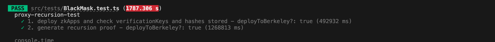
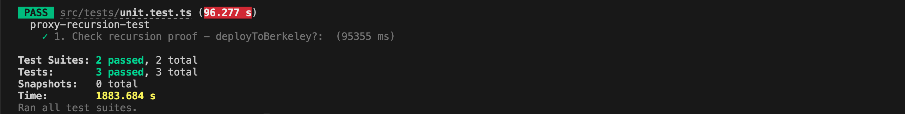

# Mina zkApp: O1js Images

This template uses TypeScript.

## How to build

```sh
npm run build
```

## How to run tests

```sh
npm run test
npm run testw # watch mode
```




## How to run coverage

```sh
npm run coverage
```

## License

[Apache-2.0](LICENSE)

# Overview of Zero-Knowledge Proof Implementation with o1js POC

Please see: (https://gordonfreemanfree.github.io/o1js-images/) for an illustration.
Remember this is an POC.

This codebase demonstrates an advanced implementation of zero-knowledge proofs using o1js, tailored for privacy-preserving image processing and blockchain-based data verification. Below is a detailed explanation of its key components and functionalities.

## 1. Zero-Knowledge Proof Definition ('RecursionProofSystem')

### Purpose

Defines a zero-knowledge proof system to ensure privacy and security in operations related to pixel data manipulation and image authentication.

This project involves many operations (O(N); N = pixels per image) and I did a lot of tests to find an approach to be able to implement this. Unfortunately I was quite often facing Stackoverflows. But this can be solved in the future...

### Key Functions

- 'blackPixel_first': Verifies the hash of the initial pixel array and modifies pixels based on a mask.
- 'blackPixel_second': Verifies a previous proof and ensures the consistency of the hash chain in subsequent operations.

## 2. Pixel and Mask Class Definitions

### PixelArrayClass1000 and MaskClass

- These classes handle pixel data and masks, including functions to convert arrays to their respective class formats and methods for operations like blacking pixels.
- More Methods should be implemented in the future.

## 3. Recursive Proof Generation (callRecursionBlack)

### Purpose

Orchestrates the generation of recursive proofs for a series of pixel data transformations.

### Process

Iterates over an array of pixel data, generating and verifying proofs at each step to maintain a consistent and verifiable chain of transformations.

## 4. Smart Contract Implementation (BlackMask)

### Role

Represents a smart contract that manages and verifies proofs generated by the RecursionProofSystem.

### Key Methods

- setHash: Sets the hash of the current pixel data.
- blackMask: Verifies a given proof against the current pixel hash and updates the state.

## 5. Auxiliary Functions and Data Handling

### Utility Functions

- Functions for generating random masks and handling data are provided.

## 6. Execution Flow

- The flow involves initializing the proof system, preparing pixel data and masks, generating proofs through recursive calls, and finally integrating these proofs into a smart contract framework for verification and state management.

## 7. Key Technologies and Concepts

### Zero-Knowledge Proofs (Zk-SNARKs)

- Ensures privacy and integrity without revealing underlying image data.

### Smart Contracts

- Automates operations and state management on the blockchain.

### Data Manipulation and Verification

- Ensures the consistency and correctness of operations on pixel data.

## 8. Potential Use Cases

### Privacy-Preserving Image Processing

- Allows for operations on images where the contents need to be kept private.

### Blockchain-Based Image Verification

- Ensures the integrity and non-tamperability of image data in a decentralized context.

## Conclusion

This implementation demonstrates an advanced use of zero-knowledge proofs in conjunction with smart contracts for managing and verifying operations on image data as a POC. It is illustrating a potential application in privacy-preserving image processing and blockchain-based data verification.
